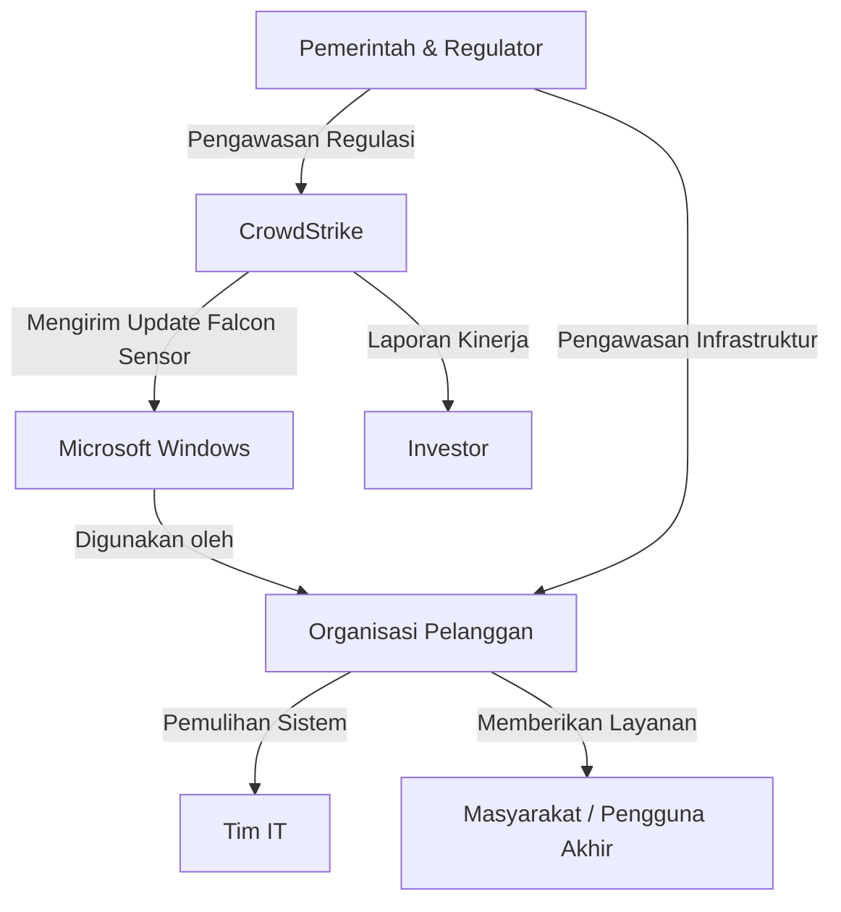

 
# LAPORAN ETIKA PROFESI  
# ANALISIS KASUS CROWDSTRIKE GLOBAL OUTAGE JULI 2024

Disusun guna memenuhi tugas pada mata kuliah Etika Profesi (B)

 **Dosen Pengampu:** Adi Wahyu Pribadi, S.Si., M.Kom
 
  
  
   
 
  ## Disusun Oleh Kelompok 3:
  
  | Nama Anggota             | NIM         |
  |--------------------------|-------------|
  | Kholil Irsyad Marwan      | 4524210110  |
  | Reza Putra Arialesta      | 4524210086  |
  | Reevan Azepha Islamy Iskandar | 4524210083 |
  | Rizwan Fauziani Ilham     | 4524210094  |
  | Muhammad Tegar Arianto    | 4524210070  |
  

  
    
  
 ## PROGRAM STUDI TEKNIK INFORMATIKA  
 
 ## FAKULTAS TEKNIK UNIVERSITAS PANCASILA
 
 ## 2025/2026
 

<h2>BAB I</h2>
<h3>PENDAHULUAN</h3>

### 1.1 Latar Belakang  

### 1.2 Rumusan Masalah  
1.	
2.
3. 	

### 1.3 Tujuan  
1. 
2. 
3. 

<h2>BAB II</h2>
<h3>PEMBAHASAN</h3>

### 2.1 Kronologi Kasus

 Insiden CrowdStrike 2024 adalah sebuah peristiwa sejumlah pengguna sistem operasi Microsoft Windows di beberapa dunia mengalami Layar Biru Maut yang terjadi sejak 19 Juli 2024. Akibatnya terjadi gangguan pada sistem penerbangan dan sistem perbankan di berbagai negara seperti Amerika Serikat dan Australia hingga ke Indonesia. Maskapai United Airlines, Delta Airlines, dan American Airlines yang semuanya berkantor pusat di Amerika Serikat telah mengeluarkan "penghentian sementara global" pada semua penerbangan mereka.Maskapai Virgin Australia dan Jetstar juga harus menunda atau membatalkan penerbangan, serta Supermarket dan perusahaan media penyiaraan di Australia harus lumpuh. Bandara Changi di Singapura juga terdampak, sehingga para petugas melakukan proses check-in secara manual. Menurut laporan dari sejumlah pengguna Microsoft Windows, gangguan terjadi setelah pengguna OS Windows melakukan update sistem keamanan CrowdStrike ke versi terbaru. CEO CrowdStrike George Kurtz menjelaskan gangguan massal tersebut akibat dari cacat yang ditemukan dalam pembaruan konten tunggal pada pemindai kelemahan Falcon Sensor untuk mesin berbasis Windows.

### 2.2 Fakta Kunci & Catatan Transparansi

 

### 2.3 Pemetaan Pemangku Kepentingan (Stakeholder Mapping)

  Kasus CrowdStrike Global Outage yang terjadi pada 19 Juli 2024 melibatkan berbagai pihak yang memiliki peran, kepentingan, serta tingkat pengaruh yang berbeda-beda. Gangguan yang disebabkan oleh pembaruan (update) Falcon Sensor yang bermasalah mengakibatkan sekitar 8,5 juta perangkat Windows mengalami gangguan. Dampaknya tidak hanya dirasakan oleh CrowdStrike sebagai penyedia layanan keamanan siber, tetapi juga Microsoft, organisasi pelanggan, serta masyarakat yang menggunakan layanan dari organisasi tersebut.

#### 2.3.1 Identifikasi Pemangku Kepentingan
  | Pemangku Kepentingan | Peran | Dampak yang Diterima |
|----------------------|-------|----------------------|
| CrowdStrike | Pengembang dan penyedia Falcon Sensor | Mengalami penurunan reputasi, kerugian finansial, serta kehilangan kepercayaan pelanggan. |
| Microsoft | Penyedia sistem operasi Windows | Membantu proses identifikasi dan pemulihan sistem meskipun bukan penyebab utama insiden. |
| Organisasi Pelanggan (Bank, Maskapai, Rumah Sakit, Pemerintah, Perusahaan) | Menggunakan Falcon Sensor pada perangkat Windows | Operasional terganggu sehingga layanan kepada masyarakat terhenti atau melambat. |
| Tim IT Organisasi | Bertanggung jawab terhadap pemeliharaan sistem | Harus melakukan pemulihan manual pada perangkat yang terdampak. |
| Pengguna Akhir (Masyarakat) | Menggunakan layanan organisasi | Mengalami keterlambatan penerbangan, gangguan transaksi, pelayanan kesehatan, dan layanan publik lainnya. |
| Investor | Pemegang saham CrowdStrike | Nilai investasi menurun akibat turunnya harga saham perusahaan. |
| Pemerintah dan Regulator | Mengawasi keamanan serta keberlangsungan layanan digital | Melakukan evaluasi terhadap tata kelola keamanan dan pembaruan perangkat lunak. |
#### 2.3.2 Pengambil Keputusan

Pada saat insiden CrowdStrike Global Outage terjadi, terdapat beberapa pihak yang memiliki kewenangan dalam mengambil keputusan untuk mengurangi dampak gangguan serta mempercepat proses pemulihan.

#### 1. Manajemen CrowdStrike
- Mengidentifikasi penyebab utama gangguan.
- Menghentikan distribusi pembaruan (update) yang bermasalah.
- Menerbitkan panduan pemulihan kepada pelanggan.
- Menyampaikan informasi resmi mengenai perkembangan insiden.

#### 2. Microsoft
- Memberikan dukungan teknis terhadap sistem operasi Windows.
- Berkoordinasi dengan CrowdStrike dalam proses pemulihan.
- Membantu pelanggan perusahaan yang mengalami gangguan.

#### 3. Manajemen Organisasi Pelanggan
- Menentukan prioritas layanan yang dipulihkan terlebih dahulu.
- Mengalokasikan sumber daya untuk proses recovery.
- Mengambil keputusan operasional agar layanan penting tetap berjalan.

#### 4. Tim IT Organisasi
- Melaksanakan proses pemulihan perangkat yang terdampak.
- Memastikan seluruh sistem kembali beroperasi dengan aman.
- Melakukan verifikasi sebelum sistem digunakan kembali.

#### 2.3.3 Hubungan Antar Pemangku Kepentingan

Hubungan antar pemangku kepentingan pada kasus CrowdStrike Global Outage dapat digambarkan sebagai berikut.

Diagram tersebut menunjukkan bahwa CrowdStrike memiliki pengaruh besar karena mendistribusikan pembaruan Falcon Sensor kepada pelanggan. Organisasi pelanggan menggunakan sistem operasi Windows sebagai platform utama sehingga ketika pembaruan mengalami kesalahan, operasional organisasi ikut terganggu. Tim IT bertugas melakukan pemulihan sistem, sedangkan masyarakat menjadi pihak yang menerima dampak secara langsung akibat terganggunya layanan.
#### 2.3.4 Analisis Pengaruh dan Kepentingan

Analisis berikut menggunakan konsep **Power-Interest Matrix** untuk menunjukkan tingkat pengaruh dan kepentingan setiap pemangku kepentingan.

| Stakeholder | Pengaruh | Kepentingan | Kategori |
|--------------|----------|-------------|----------|
| CrowdStrike | Sangat Tinggi | Sangat Tinggi | Key Player |
| Microsoft | Tinggi | Tinggi | Key Player |
| Organisasi Pelanggan | Tinggi | Sangat Tinggi | Key Player |
| Tim IT Organisasi | Sedang | Tinggi | Keep Involved |
| Pemerintah & Regulator | Tinggi | Sedang | Keep Satisfied |
| Investor | Sedang | Sedang | Keep Satisfied |
| Pengguna Akhir | Rendah | Tinggi | Keep Informed |

### Penjelasan

- **Key Player** merupakan pihak yang memiliki pengaruh dan kepentingan paling tinggi sehingga harus terlibat langsung dalam proses penanganan insiden.
- **Keep Involved** adalah pihak yang aktif membantu pelaksanaan pemulihan sistem.
- **Keep Satisfied** adalah pihak yang perlu memperoleh informasi dan jaminan bahwa proses pemulihan berjalan dengan baik.
- **Keep Informed** merupakan pihak yang terdampak secara langsung sehingga memerlukan informasi yang transparan mengenai perkembangan pemulihan.

#### 2.3.5 Analisis Relasi Kekuasaan

Dalam kasus CrowdStrike Global Outage, CrowdStrike merupakan pihak yang memiliki tingkat kekuasaan (power) paling tinggi karena bertanggung jawab terhadap distribusi pembaruan Falcon Sensor yang menyebabkan gangguan. Microsoft memiliki pengaruh besar sebagai penyedia sistem operasi Windows yang digunakan oleh jutaan perangkat pelanggan.

Organisasi pelanggan memiliki kewenangan dalam menentukan strategi pemulihan internal sesuai prioritas layanan masing-masing. Tim IT bertugas menjalankan keputusan tersebut melalui proses pemulihan perangkat secara bertahap. Sementara itu, masyarakat sebagai pengguna layanan tidak memiliki kewenangan dalam pengambilan keputusan, namun menjadi pihak yang paling merasakan dampak akibat terhentinya layanan digital.

Hubungan antar pemangku kepentingan menunjukkan bahwa komunikasi yang cepat, koordinasi yang efektif, dan transparansi informasi sangat penting untuk meminimalkan dampak gangguan terhadap operasional organisasi maupun masyarakat.

### 2.4 Analisis Kasus Menggunakan Empat Teori Etika

Analisis etika dilakukan untuk menilai tindakan yang diambil oleh CrowdStrike selama terjadinya insiden CrowdStrike Global Outage pada Juli 2024. Empat teori etika yang digunakan adalah Utilitarianisme, Deontologi, Etika Kebajikan (Virtue Ethics), dan Etika Kepedulian (Care Ethics).

---

#### 2.4.1 Analisis Berdasarkan Teori Utilitarianisme

Teori Utilitarianisme menyatakan bahwa suatu tindakan dianggap benar apabila menghasilkan manfaat terbesar bagi sebanyak mungkin orang.

Pada kasus CrowdStrike Global Outage, pembaruan Falcon Sensor sebenarnya bertujuan meningkatkan keamanan sistem pelanggan. Namun, kesalahan dalam proses validasi pembaruan menyebabkan sekitar 8,5 juta perangkat Windows mengalami gangguan sehingga layanan penting seperti rumah sakit, maskapai penerbangan, bank, dan instansi pemerintah tidak dapat beroperasi secara normal.

Setelah mengetahui adanya kesalahan, CrowdStrike segera menghentikan distribusi pembaruan, memberikan panduan pemulihan, dan bekerja sama dengan Microsoft untuk mempercepat proses recovery. Dari sudut pandang utilitarianisme, keputusan tersebut merupakan upaya untuk mengurangi dampak negatif yang dialami pelanggan meskipun kerugian yang telah terjadi sangat besar.

**Kesimpulan:**
Tindakan awal CrowdStrike belum memenuhi prinsip utilitarianisme karena menimbulkan kerugian bagi banyak pihak. Namun, langkah pemulihan yang cepat menunjukkan usaha perusahaan untuk memaksimalkan manfaat bagi pelanggan setelah insiden terjadi.

---

#### 2.4.2 Analisis Berdasarkan Teori Deontologi

Teori Deontologi menekankan bahwa setiap organisasi memiliki kewajiban moral untuk menjalankan tugasnya sesuai aturan dan tanggung jawab tanpa melihat hasil akhirnya.

Sebagai perusahaan keamanan siber, CrowdStrike memiliki kewajiban untuk memastikan setiap pembaruan perangkat lunak telah melalui proses pengujian yang memadai sebelum didistribusikan kepada pelanggan. Kesalahan validasi yang menyebabkan gangguan menunjukkan bahwa kewajiban tersebut belum dilaksanakan secara optimal.

Meskipun demikian, CrowdStrike tetap memenuhi tanggung jawab etis setelah insiden terjadi dengan memberikan penjelasan resmi, menyediakan solusi pemulihan, serta berkoordinasi dengan Microsoft dan pelanggan.

**Kesimpulan:**
Berdasarkan teori deontologi, CrowdStrike belum sepenuhnya memenuhi kewajiban profesional pada tahap distribusi pembaruan, tetapi telah menunjukkan tanggung jawab dalam proses penanganan insiden.

---

#### 2.4.3 Analisis Berdasarkan Teori Etika Kebajikan (Virtue Ethics)

Etika Kebajikan menilai tindakan berdasarkan karakter moral yang dimiliki seseorang atau organisasi, seperti kejujuran, tanggung jawab, keberanian, dan integritas.

Dalam kasus ini, CrowdStrike tidak menutupi penyebab gangguan dan secara terbuka mengakui bahwa insiden disebabkan oleh kesalahan pada pembaruan Falcon Sensor, bukan akibat serangan siber. Perusahaan juga terus memberikan pembaruan informasi kepada pelanggan selama proses pemulihan.

Sikap terbuka tersebut mencerminkan nilai kejujuran dan tanggung jawab, meskipun perusahaan tetap harus meningkatkan kualitas pengujian agar kesalahan serupa tidak terulang.

**Kesimpulan:**
Dari perspektif Etika Kebajikan, CrowdStrike menunjukkan karakter yang baik dalam hal transparansi dan tanggung jawab setelah insiden, tetapi perlu meningkatkan kehati-hatian sebelum mendistribusikan pembaruan.

---

#### 2.4.4 Analisis Berdasarkan Teori Etika Kepedulian (Care Ethics)

Etika Kepedulian menekankan pentingnya hubungan, empati, dan perhatian terhadap pihak-pihak yang terdampak oleh suatu keputusan.

CrowdStrike memberikan panduan pemulihan kepada pelanggan, bekerja sama dengan Microsoft, serta menyediakan dukungan teknis selama proses recovery. Langkah tersebut menunjukkan adanya kepedulian terhadap organisasi yang mengalami gangguan.

Namun, karena gangguan telah menyebabkan berhentinya berbagai layanan publik, perusahaan juga perlu memastikan adanya mekanisme pencegahan yang lebih baik agar kepentingan pelanggan tetap terlindungi di masa mendatang.

**Kesimpulan:**
Berdasarkan Etika Kepedulian, CrowdStrike telah menunjukkan perhatian terhadap pelanggan melalui proses pemulihan, tetapi aspek pencegahan sebelum pembaruan masih perlu ditingkatkan.

---

#### 2.4.5 Kesimpulan Analisis Empat Teori Etika

Keempat teori etika memberikan sudut pandang yang berbeda terhadap insiden CrowdStrike Global Outage.

| Teori Etika | Hasil Analisis |
|--------------|----------------|
| Utilitarianisme | Pembaruan memberikan dampak negatif yang luas, tetapi proses pemulihan bertujuan meminimalkan kerugian. |
| Deontologi | CrowdStrike belum sepenuhnya memenuhi kewajiban dalam pengujian pembaruan, namun bertanggung jawab setelah insiden terjadi. |
| Etika Kebajikan | Menunjukkan kejujuran, transparansi, dan tanggung jawab selama proses penanganan. |
| Etika Kepedulian | Memberikan perhatian kepada pelanggan melalui dukungan teknis dan proses pemulihan, namun perlu meningkatkan langkah pencegahan. |

Secara keseluruhan, insiden CrowdStrike Global Outage menunjukkan bahwa tanggung jawab etis tidak hanya berkaitan dengan penanganan setelah insiden, tetapi juga mencakup pencegahan melalui proses pengujian perangkat lunak yang lebih ketat sebelum pembaruan didistribusikan kepada pelanggan.

### 2.5 Lensa Kelima 

 

### 2.6 Kode Etika Profesi

 

### 2.7 Analsisi Regulasi dan Hukum

#### 2.7.1 UU ITE

#### 2.7.2 UU PDP

#### 2.7.3 Regulasi Sektorat Terkait

 

### 2.8 Checkpoint Integritas & Anti-Korupsi

### 2.9 Manajemen Risiko & Opsi 4T

 

### 2.10 Rancangan Dampak & Kontrol Preventif

<h2>BAB III</h2>
<h3>PENUTUP</h3>

### 3.1 Kesimpulan 

 

### 3.2 Saran  

 

<h2>DAFTAR PUSTAKA</h2>

---
