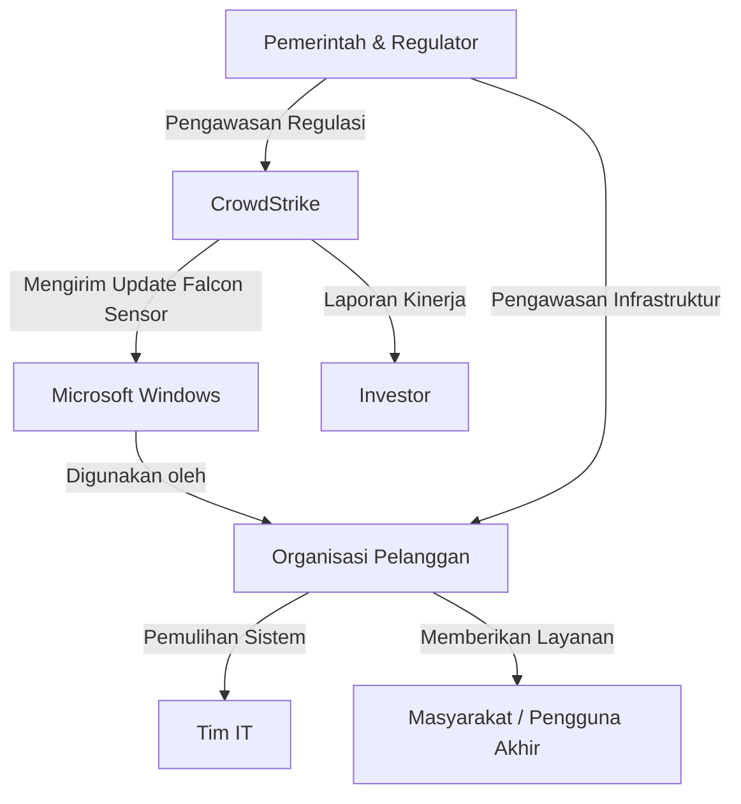
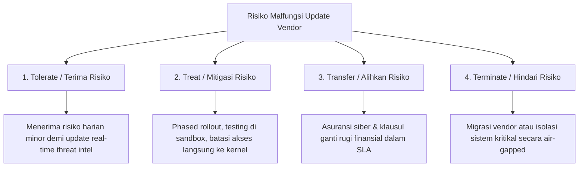

 
# LAPORAN ETIKA PROFESI  
# ANALISIS KASUS CROWDSTRIKE GLOBAL OUTAGE JULI 2024

Disusun guna memenuhi tugas pada mata kuliah Etika Profesi (B)

 **Dosen Pengampu:** Adi Wahyu Pribadi, S.Si., M.Kom
 
  
  
   
 
  ## Disusun Oleh Kelompok 3:
  
  | Nama Anggota             | NIM         |
  |--------------------------|-------------|
  | Kholil Irsyad Marwan      | 4524210110  |
  | Reza Putra Arialesta      | 4524210086  |
  | Reevan Azepha Islamy Iskandar | 4524210083 |
  | Rizwan Fauziani Ilham     | 4524210094  |
  | Muhammad Tegar Arianto    | 4524210070  |
  

  
    
  
 ## PROGRAM STUDI TEKNIK INFORMATIKA  
 
 ## FAKULTAS TEKNIK UNIVERSITAS PANCASILA
 
 ## 2025/2026
 

<h2>BAB I</h2>
<h3>PENDAHULUAN</h3>

### 1.1 Latar Belakang  

Perkembangan teknologi saat ini semakin pesat, dimana berbagai sistem modern saling terhubung dan berpengaruh pada sektor industri, ketergantungan pada sistem membuat kesalahan kecil bisa memberikan dampak luas, dimana pada tanggal  19 Juli 2024 terjadi kesalahan pada perusahaan CrowdStrike yang ingin melakukan pembaruan / update  perangkat lunak yang bernama Falcon Sensor untuk  program keamanan, yang harusnya melindungi sistem operasi Microsoft Windows, akan tetapi malah menampilkan Blue Screen of Death (BSOD), dan berdampak ke banyak komputer.[1]

Microsoft selaku tim pengembangan, berpendapat bahwa gangguan ini berdampak ke 8,5 juta  pengguna windows, meskipun berdampak kurang dari 1% ke pengguna diseluruh dunia, tapi dampaknya bisa ke berbagai  sektor industri,seperti bandara, perbankan, rumah sakit, saham dan perusahaan besar lainnya.[2]

Penyebab utamanya itu  bukan dari serangan cyber, akan tetapi terdapat bug yang ada didalam pengujian perangkat lunak, yang masih tidak tervalidasi, tetapi lolos dari proses pengujian dan sudah terlanjur disebarkan ke jutaan komputer, seharusnya perlu di lakukan proses testing dan quality control, terutama pada software yang memiliki akses lebih ke sistem operasi.[2]

### 1.2 Rumusan Masalah  
1.	Apa penyebab utama terjadinya gangguan sistem akibat pembaruan (update) CrowdStrike Falcon Sensor pada perangkat berbasis Microsoft Windows?
2. Bagaimana dampak kegagalan pembaruan CrowdStrike terhadap berbagai sektor yang bergantung pada sistem teknologi informasi?
3. Bagaimana penerapan etika profesi, regulasi, dan manajemen risiko dalam menganalisis serta mencegah terulangnya kasus serupa di masa mendatang?

### 1.3 Tujuan  
1. Mengetahui penyebab terjadinya gangguan sistem yang disebabkan oleh pembaruan CrowdStrike Falcon Sensor pada sistem operasi Microsoft Windows.
2. Menganalisis dampak yang ditimbulkan terhadap pengguna, organisasi, dan sektor industri akibat kegagalan pembaruan tersebut.
3. Menganalisis kasus berdasarkan teori etika, kode etik profesi, regulasi yang berlaku, serta memberikan rekomendasi pencegahan agar kejadian serupa tidak terulang.

<h2>BAB II</h2>
<h3>PEMBAHASAN</h3>

### 2.1 Kronologi Kasus

Insiden CrowdStrike 2024 merupakan gangguan teknologi informasi berskala global yang terjadi pada 19 Juli 2024. Gangguan bermula setelah CrowdStrike merilis pembaruan (update) konten untuk perangkat lunak keamanan Falcon Sensor yang digunakan pada sistem operasi Microsoft Windows. Pembaruan tersebut mengandung cacat (bug) sehingga menyebabkan banyak perangkat Windows mengalami Blue Screen of Death (BSOD) dan gagal melakukan proses booting. Akibatnya, berbagai layanan penting di seluruh dunia mengalami gangguan operasional [5]. 

Dampak insiden tersebut dirasakan oleh berbagai sektor, khususnya transportasi udara, perbankan, layanan kesehatan, media, dan pemerintahan. Sejumlah maskapai penerbangan seperti United Airlines, Delta Air Lines, American Airlines, Virgin Australia, dan Jetstar terpaksa menunda atau membatalkan penerbangan. Selain itu, Bandara Changi Singapura melakukan proses check-in secara manual, sementara supermarket dan perusahaan media di Australia juga mengalami gangguan operasional [5]. 

CEO CrowdStrike, George Kurtz, menjelaskan bahwa penyebab insiden bukan merupakan serangan siber, melainkan cacat pada pembaruan konten Falcon Sensor yang hanya memengaruhi perangkat berbasis Windows. Setelah mengetahui penyebabnya, CrowdStrike menarik pembaruan yang bermasalah dan menyediakan panduan pemulihan bagi pelanggan [5]. 

Insiden ini kemudian berkembang menjadi persoalan hukum. Delta Air Lines menuduh CrowdStrike melakukan kelalaian besar dalam proses pengujian pembaruan perangkat lunak sehingga menyebabkan kerugian operasional yang sangat besar. Sementara itu, CrowdStrike membantah bahwa seluruh kerugian Delta disebabkan oleh pembaruan tersebut dan menyatakan bahwa sebagian gangguan dipengaruhi oleh sistem internal Delta. CrowdStrike juga menunjuk firma hukum Quinn Emanuel Urquhart & Sullivan untuk menghadapi berbagai gugatan hukum yang diperkirakan akan muncul akibat insiden tersebut [5].

### 2.2 Fakta Kunci & Catatan Transparansi

| No. | Fakta Kunci | Catatan Transparansi |
|:---:|-------------|----------------------|
| 1 | Pada 19 Juli 2024, CrowdStrike merilis pembaruan  Falcon Sensor untuk sistem operasi Windows. | Informasi mengenai tanggal dan pembaruan ini berasal dari pernyataan resmi CrowdStrike dan telah diberitakan oleh berbagai media terpercaya. |
| 2 | Setelah pembaruan dipasang, banyak perangkat Windows mengalami Blue Screen of Death (BSOD) sehingga tidak dapat digunakan. | CrowdStrike menjelaskan bahwa gangguan tersebut terjadi karena kesalahan pada pembaruan yang dirilis, bukan akibat serangan siber. |
| 3 | Gangguan tersebut berdampak pada berbagai sektor, seperti maskapai penerbangan, rumah sakit, perbankan, instansi pemerintah, dan perusahaan swasta di berbagai negara. | Dampak ini telah dilaporkan oleh berbagai media dan diakui oleh sejumlah organisasi yang terdampak. |
| 4 | Microsoft turut membantu proses pemulihan agar perangkat yang terdampak dapat kembali beroperasi. | Informasi ini disampaikan secara resmi oleh Microsoft dan CrowdStrike. |
| 5 | Delta Air Lines berencana mengajukan gugatan terhadap CrowdStrike dengan nilai sekitar US$500 juta atau sekitar Rp7,7 triliun. | Informasi tersebut masih berupa rencana gugatan yang dilaporkan oleh media dan belum merupakan putusan pengadilan. |
| 6 | Hingga laporan ini disusun, CrowdStrike belum menjelaskan secara rinci bagaimana proses pengujian pembaruan dilakukan maupun siapa yang memberikan persetujuan sebelum pembaruan dirilis. | Belum ada penjelasan resmi, informasi masih memiliki keterbatasan dan memerlukan klarifikasi lebih lanjut dari pihak CrowdStrike. |
| 7 | Hingga saat ini belum ada data resmi mengenai total kerugian yang dialami seluruh organisasi yang terdampak. | Besarnya kerugian secara keseluruhan belum dapat dipastikan berdasarkan informasi yang tersedia. |masi yang masih perlu dikonfirmasi. Dengan demikian, pembahasan dalam laporan ini diharapkan lebih dapat dipercaya dan tidak dibuat berdasarkan perkiraan semata.

### 2.3 Pemetaan Pemangku Kepentingan (Stakeholder Mapping)

  Kasus CrowdStrike Global Outage yang terjadi pada 19 Juli 2024 melibatkan berbagai pihak yang memiliki peran, kepentingan, serta tingkat pengaruh yang berbeda-beda. Gangguan yang disebabkan oleh pembaruan (update) Falcon Sensor yang bermasalah mengakibatkan sekitar 8,5 juta perangkat Windows mengalami gangguan. Dampaknya tidak hanya dirasakan oleh CrowdStrike sebagai penyedia layanan keamanan siber, tetapi juga Microsoft, organisasi pelanggan, serta masyarakat yang menggunakan layanan dari organisasi tersebut.

#### 2.3.1 Identifikasi Pemangku Kepentingan
  | Pemangku Kepentingan | Peran | Dampak yang Diterima |
|----------------------|-------|----------------------|
| CrowdStrike | Pengembang dan penyedia Falcon Sensor | Mengalami penurunan reputasi, kerugian finansial, serta kehilangan kepercayaan pelanggan. |
| Microsoft | Penyedia sistem operasi Windows | Membantu proses identifikasi dan pemulihan sistem meskipun bukan penyebab utama insiden. |
| Organisasi Pelanggan (Bank, Maskapai, Rumah Sakit, Pemerintah, Perusahaan) | Menggunakan Falcon Sensor pada perangkat Windows | Operasional terganggu sehingga layanan kepada masyarakat terhenti atau melambat. |
| Tim IT Organisasi | Bertanggung jawab terhadap pemeliharaan sistem | Harus melakukan pemulihan manual pada perangkat yang terdampak. |
| Pengguna Akhir (Masyarakat) | Menggunakan layanan organisasi | Mengalami keterlambatan penerbangan, gangguan transaksi, pelayanan kesehatan, dan layanan publik lainnya. |
| Investor | Pemegang saham CrowdStrike | Nilai investasi menurun akibat turunnya harga saham perusahaan. |
| Pemerintah dan Regulator | Mengawasi keamanan serta keberlangsungan layanan digital | Melakukan evaluasi terhadap tata kelola keamanan dan pembaruan perangkat lunak. |
#### 2.3.2 Pengambil Keputusan

Pada saat insiden CrowdStrike Global Outage terjadi, terdapat beberapa pihak yang memiliki kewenangan dalam mengambil keputusan untuk mengurangi dampak gangguan serta mempercepat proses pemulihan.

#### 1. Manajemen CrowdStrike
- Mengidentifikasi penyebab utama gangguan.
- Menghentikan distribusi pembaruan (update) yang bermasalah.
- Menerbitkan panduan pemulihan kepada pelanggan.
- Menyampaikan informasi resmi mengenai perkembangan insiden.

#### 2. Microsoft
- Memberikan dukungan teknis terhadap sistem operasi Windows.
- Berkoordinasi dengan CrowdStrike dalam proses pemulihan.
- Membantu pelanggan perusahaan yang mengalami gangguan.

#### 3. Manajemen Organisasi Pelanggan
- Menentukan prioritas layanan yang dipulihkan terlebih dahulu.
- Mengalokasikan sumber daya untuk proses recovery.
- Mengambil keputusan operasional agar layanan penting tetap berjalan.

#### 4. Tim IT Organisasi
- Melaksanakan proses pemulihan perangkat yang terdampak.
- Memastikan seluruh sistem kembali beroperasi dengan aman.
- Melakukan verifikasi sebelum sistem digunakan kembali.

#### 2.3.3 Hubungan Antar Pemangku Kepentingan

Hubungan antar pemangku kepentingan pada kasus CrowdStrike Global Outage dapat digambarkan sebagai berikut.

Diagram tersebut menunjukkan bahwa CrowdStrike memiliki pengaruh besar karena mendistribusikan pembaruan Falcon Sensor kepada pelanggan. Organisasi pelanggan menggunakan sistem operasi Windows sebagai platform utama sehingga ketika pembaruan mengalami kesalahan, operasional organisasi ikut terganggu. Tim IT bertugas melakukan pemulihan sistem, sedangkan masyarakat menjadi pihak yang menerima dampak secara langsung akibat terganggunya layanan.
#### 2.3.4 Analisis Pengaruh dan Kepentingan

Analisis berikut menggunakan konsep **Power-Interest Matrix** untuk menunjukkan tingkat pengaruh dan kepentingan setiap pemangku kepentingan.

| Stakeholder | Pengaruh | Kepentingan | Kategori |
|--------------|----------|-------------|----------|
| CrowdStrike | Sangat Tinggi | Sangat Tinggi | Key Player |
| Microsoft | Tinggi | Tinggi | Key Player |
| Organisasi Pelanggan | Tinggi | Sangat Tinggi | Key Player |
| Tim IT Organisasi | Sedang | Tinggi | Keep Involved |
| Pemerintah & Regulator | Tinggi | Sedang | Keep Satisfied |
| Investor | Sedang | Sedang | Keep Satisfied |
| Pengguna Akhir | Rendah | Tinggi | Keep Informed |

### Penjelasan

- **Key Player** merupakan pihak yang memiliki pengaruh dan kepentingan paling tinggi sehingga harus terlibat langsung dalam proses penanganan insiden.
- **Keep Involved** adalah pihak yang aktif membantu pelaksanaan pemulihan sistem.
- **Keep Satisfied** adalah pihak yang perlu memperoleh informasi dan jaminan bahwa proses pemulihan berjalan dengan baik.
- **Keep Informed** merupakan pihak yang terdampak secara langsung sehingga memerlukan informasi yang transparan mengenai perkembangan pemulihan.

#### 2.3.5 Analisis Relasi Kekuasaan

Dalam kasus CrowdStrike Global Outage, CrowdStrike merupakan pihak yang memiliki tingkat kekuasaan (power) paling tinggi karena bertanggung jawab terhadap distribusi pembaruan Falcon Sensor yang menyebabkan gangguan. Microsoft memiliki pengaruh besar sebagai penyedia sistem operasi Windows yang digunakan oleh jutaan perangkat pelanggan.

Organisasi pelanggan memiliki kewenangan dalam menentukan strategi pemulihan internal sesuai prioritas layanan masing-masing. Tim IT bertugas menjalankan keputusan tersebut melalui proses pemulihan perangkat secara bertahap. Sementara itu, masyarakat sebagai pengguna layanan tidak memiliki kewenangan dalam pengambilan keputusan, namun menjadi pihak yang paling merasakan dampak akibat terhentinya layanan digital.

Hubungan antar pemangku kepentingan menunjukkan bahwa komunikasi yang cepat, koordinasi yang efektif, dan transparansi informasi sangat penting untuk meminimalkan dampak gangguan terhadap operasional organisasi maupun masyarakat.

### 2.4 Analisis Kasus Menggunakan Empat Teori Etika

Analisis etika dilakukan untuk menilai tindakan yang diambil oleh CrowdStrike selama terjadinya insiden CrowdStrike Global Outage pada Juli 2024. Empat teori etika yang digunakan adalah Utilitarianisme, Deontologi, Etika Kebajikan (Virtue Ethics), dan Etika Kepedulian (Care Ethics).

---

#### 2.4.1 Analisis Berdasarkan Teori Utilitarianisme

Teori Utilitarianisme menyatakan bahwa suatu tindakan dianggap benar apabila menghasilkan manfaat terbesar bagi sebanyak mungkin orang.

Pada kasus CrowdStrike Global Outage, pembaruan Falcon Sensor sebenarnya bertujuan meningkatkan keamanan sistem pelanggan. Namun, kesalahan dalam proses validasi pembaruan menyebabkan sekitar 8,5 juta perangkat Windows mengalami gangguan sehingga layanan penting seperti rumah sakit, maskapai penerbangan, bank, dan instansi pemerintah tidak dapat beroperasi secara normal.

Setelah mengetahui adanya kesalahan, CrowdStrike segera menghentikan distribusi pembaruan, memberikan panduan pemulihan, dan bekerja sama dengan Microsoft untuk mempercepat proses recovery. Dari sudut pandang utilitarianisme, keputusan tersebut merupakan upaya untuk mengurangi dampak negatif yang dialami pelanggan meskipun kerugian yang telah terjadi sangat besar.

**Kesimpulan:**
Tindakan awal CrowdStrike belum memenuhi prinsip utilitarianisme karena menimbulkan kerugian bagi banyak pihak. Namun, langkah pemulihan yang cepat menunjukkan usaha perusahaan untuk memaksimalkan manfaat bagi pelanggan setelah insiden terjadi.

---

#### 2.4.2 Analisis Berdasarkan Teori Deontologi

Teori Deontologi menekankan bahwa setiap organisasi memiliki kewajiban moral untuk menjalankan tugasnya sesuai aturan dan tanggung jawab tanpa melihat hasil akhirnya.

Sebagai perusahaan keamanan siber, CrowdStrike memiliki kewajiban untuk memastikan setiap pembaruan perangkat lunak telah melalui proses pengujian yang memadai sebelum didistribusikan kepada pelanggan. Kesalahan validasi yang menyebabkan gangguan menunjukkan bahwa kewajiban tersebut belum dilaksanakan secara optimal.

Meskipun demikian, CrowdStrike tetap memenuhi tanggung jawab etis setelah insiden terjadi dengan memberikan penjelasan resmi, menyediakan solusi pemulihan, serta berkoordinasi dengan Microsoft dan pelanggan.

**Kesimpulan:**
Berdasarkan teori deontologi, CrowdStrike belum sepenuhnya memenuhi kewajiban profesional pada tahap distribusi pembaruan, tetapi telah menunjukkan tanggung jawab dalam proses penanganan insiden.

---

#### 2.4.3 Analisis Berdasarkan Teori Etika Kebajikan (Virtue Ethics)

Etika Kebajikan menilai tindakan berdasarkan karakter moral yang dimiliki seseorang atau organisasi, seperti kejujuran, tanggung jawab, keberanian, dan integritas.

Dalam kasus ini, CrowdStrike tidak menutupi penyebab gangguan dan secara terbuka mengakui bahwa insiden disebabkan oleh kesalahan pada pembaruan Falcon Sensor, bukan akibat serangan siber. Perusahaan juga terus memberikan pembaruan informasi kepada pelanggan selama proses pemulihan.

Sikap terbuka tersebut mencerminkan nilai kejujuran dan tanggung jawab, meskipun perusahaan tetap harus meningkatkan kualitas pengujian agar kesalahan serupa tidak terulang.

**Kesimpulan:**
Dari perspektif Etika Kebajikan, CrowdStrike menunjukkan karakter yang baik dalam hal transparansi dan tanggung jawab setelah insiden, tetapi perlu meningkatkan kehati-hatian sebelum mendistribusikan pembaruan.

---

#### 2.4.4 Analisis Berdasarkan Teori Etika Kepedulian (Care Ethics)

Etika Kepedulian menekankan pentingnya hubungan, empati, dan perhatian terhadap pihak-pihak yang terdampak oleh suatu keputusan.

CrowdStrike memberikan panduan pemulihan kepada pelanggan, bekerja sama dengan Microsoft, serta menyediakan dukungan teknis selama proses recovery. Langkah tersebut menunjukkan adanya kepedulian terhadap organisasi yang mengalami gangguan.

Namun, karena gangguan telah menyebabkan berhentinya berbagai layanan publik, perusahaan juga perlu memastikan adanya mekanisme pencegahan yang lebih baik agar kepentingan pelanggan tetap terlindungi di masa mendatang.

**Kesimpulan:**
Berdasarkan Etika Kepedulian, CrowdStrike telah menunjukkan perhatian terhadap pelanggan melalui proses pemulihan, tetapi aspek pencegahan sebelum pembaruan masih perlu ditingkatkan.

---

#### 2.4.5 Kesimpulan Analisis Empat Teori Etika

Keempat teori etika memberikan sudut pandang yang berbeda terhadap insiden CrowdStrike Global Outage.

| Teori Etika | Hasil Analisis |
|--------------|----------------|
| Utilitarianisme | Pembaruan memberikan dampak negatif yang luas, tetapi proses pemulihan bertujuan meminimalkan kerugian. |
| Deontologi | CrowdStrike belum sepenuhnya memenuhi kewajiban dalam pengujian pembaruan, namun bertanggung jawab setelah insiden terjadi. |
| Etika Kebajikan | Menunjukkan kejujuran, transparansi, dan tanggung jawab selama proses penanganan. |
| Etika Kepedulian | Memberikan perhatian kepada pelanggan melalui dukungan teknis dan proses pemulihan, namun perlu meningkatkan langkah pencegahan. |

Secara keseluruhan, insiden CrowdStrike Global Outage menunjukkan bahwa tanggung jawab etis tidak hanya berkaitan dengan penanganan setelah insiden, tetapi juga mencakup pencegahan melalui proses pengujian perangkat lunak yang lebih ketat sebelum pembaruan didistribusikan kepada pelanggan.

### 2.5 Lensa Kelima 
#### 2.5.1 Analisis sila 1–5 yang relevan

Pada Sila Kedua, Kemanusiaan yang Adil dan Beradab, terdapat nilai yang mengajarkan bahwa setiap tindakan harus memperhatikan dampaknya terhadap orang lain. Dalam kasus ini, pembaruan yang dirilis menyebabkan jutaan perangkat Windows mengalami gangguan sehingga berbagai layanan penting ikut terdampak. seharusnya perusahaan perlu lebih berhati-hati sebelum merilis pembaruan kepada pengguna. Proses pengujian yang dilakukan secara menyeluruh menjadi langkah penting untuk mengurangi risiko kesalahan yang dapat merugikan banyak pihak. sehingga perusahaan dicap sebagai perusahaan yang bertanggung jawab untuk menjaga keamanan dan kenyamanan para penggunanya.

Sementara itu, Sila Kelima, Keadilan Sosial bagi Seluruh Rakyat Indonesia, mengajarkan bahwa setiap pengguna berhak mendapatkan pelayanan yang baik dan adil. Dalam kasus CrowdStrike, gangguan yang terjadi tidak hanya dialami oleh satu perusahaan, tetapi juga memengaruhi banyak organisasi di berbagai negara. CrowdStrike harus bertanggung jawab dengan memberikan informasi yang terbuka, segera memperbaiki kesalahan, dan membantu proses pemulihan agar seluruh pengguna dapat kembali menggunakan sistem dengan normal.

####  Nilai Kepancasilaan UP (Integritas, Kepedulian, Harmonis, Kolaboratif, Profesionalisme).

Integritas
Perusahaan perlu bersikap jujur dengan mengakui bahwa gangguan terjadi karena pembaruan yang mereka rilis. Sikap terbuka seperti ini penting agar pengguna mengetahui penyebab masalah dan perusahaan dapat mempertanggungjawabkan tindakannya.

Kepedulian
Setelah gangguan terjadi, perusahaan perlu memperhatikan dampak yang dirasakan oleh para pengguna. Upaya memberikan bantuan, informasi, dan mempercepat proses pemulihan merupakan bentuk kepedulian terhadap organisasi maupun masyarakat yang terdampak.

Harmonis
Nilai harmonis terlihat dari pentingnya menjaga hubungan baik antara perusahaan dengan pengguna, mitra, dan pihak lain yang terdampak. Komunikasi yang terbuka selama proses penanganan insiden membantu menjaga kepercayaan dan mengurangi kesalahpahaman.

Kolaboratif
Kasus ini menunjukkan bahwa penyelesaian masalah tidak dapat dilakukan oleh satu pihak saja. CrowdStrike bekerja sama dengan Microsoft dan berbagai organisasi untuk mempercepat proses pemulihan sistem sehingga layanan dapat kembali berjalan dengan baik.

Profesionalisme
Kasus ini menjadi pengingat bahwa setiap pembaruan perangkat lunak harus melalui proses pengujian yang matang sebelum dirilis. Profesionalisme juga terlihat dari kemampuan perusahaan dalam menangani insiden secara cepat, memberikan solusi, dan terus melakukan evaluasi agar kesalahan serupa tidak terulang.

### 2.6 Kode Etika Profesi

  Kode etik bahwa seorang profesional di bidang teknologi harus berusaha menghindari tindakan yang dapat merugikan orang lain. Pada kasus CrowdStrike, pembaruan Falcon Sensor justru menyebabkan jutaan komputer Windows mengalami gangguan (BSOD). Akibatnya, banyak layanan penting seperti penerbangan, perbankan, rumah sakit, dan perusahaan terganggu. Walaupun kesalahan tersebut tidak disengaja, dampaknya tetap merugikan banyak pihak sehingga prinsip ini menjadi sangat relevan.
 Kode etik juga mengharuskan setiap profesional untuk menghasilkan produk yang berkualitas melalui proses pengujian yang baik. Dalam kasus CrowdStrike, pembaruan yang dirilis ternyata mengandung kesalahan teknis sehingga menunjukkan bahwa proses pengujian atau quality assurance masih memiliki kelemahan. Hal ini menjadi pelajaran bahwa setiap pembaruan perangkat lunak harus diuji secara menyeluruh sebelum digunakan oleh pelanggan di seluruh dunia.
 Sebelum pembaruan dirilis, perusahaan harus mengevaluasi kemungkinan risiko yang dapat terjadi. Pada kasus ini, pembaruan yang bermasalah menunjukkan bahwa evaluasi terhadap dampak pembaruan pada berbagai versi Windows belum dilakukan secara maksimal, sehingga kesalahan dapat menyebar ke jutaan perangkat.
 Setelah insiden terjadi, CrowdStrike mengakui penyebab gangguan berasal dari kesalahan pada pembaruan Falcon Sensor dan segera memberikan informasi kepada publik. Tindakan ini menunjukkan bahwa perusahaan berusaha menerapkan prinsip kejujuran dan transparansi, walaupun tetap bertanggung jawab atas kerugian yang mereka timbulkan.

### 2.7 Analsisi Regulasi dan Hukum
#### 2.7.1 UU ITE (UU No. 11 Tahun 2008 jo. UU No. 19 Tahun 2016 jo. UU No. 1 Tahun 2024)

Berdasarkan Undang-Undang Informasi dan Transaksi Elektronik (UU ITE), insiden ini dapat ditinjau dari aspek tanggung jawab Penyelenggara Sistem Elektronik (PSE):
 1. Pasal 15 Ayat (1): Menyatakan bahwa "Setiap Penyelenggara Sistem Elektronik harus menyelenggarakan Sistem Elektronik secara andal dan aman serta bertanggung jawab terhadap beroperasinya Sistem Elektronik sebagaimana mestinya." Kegagalan validasi pembaruan Falcon Sensor yang melumpuhkan sistem klien merupakan bentuk pelanggaran atas asas keandalan sistem ini.

 2. Pasal 15 Ayat (2): PSE bertanggung jawab atas segala kerugian yang ditimbulkan akibat kelalaian sistem, kecuali jika dapat dibuktikan adanya keadaan memaksa (force majeure), kesalahan pengguna, atau kesalahan pihak ketiga. Karena insiden ini murni kesalahan internal Quality Assurance (QA) CrowdStrike, maka secara hukum PSE memiliki beban tanggung jawab ganti rugi terhadap kerugian operasional yang menimpa mitra di Indonesia.

#### 2.7.2 UU PDP

Meskipun insiden CrowdStrike adalah masalah ketersediaan sistem (availability) dan bukan kebocoran data (data breach), hubungannya dengan Perlindungan Data Pribadi tetap ada:

 1. Pasal 16 Ayat (1) Pengendali Data Pribadi wajib menjamin keamanan data pribadi yang diproses. Ketika sistem keamanan seperti Falcon Sensor mengalami BSOD, perlindungan aktif terhadap basis data menjadi lumpuh atau berpindah ke mode darurat (fail-safe/fail-open).

 2. Risiko Keamanan Menurun, Kelumpuhan ini menciptakan celah kerentanan baru (vulnerability window) di mana perlindungan data pribadi menjadi tidak maksimal selama berjam-jam proses pemulihan manual dilakukan, yang berpotensi melanggar kewajiban menjaga kerahasiaan dan integritas data jika dimanfaatkan oleh aktor ancaman lain.

#### 2.7.3 Regulasi Sektorat Terkait

 
 1. Sektor Perbankan/Keuangan (Regulasi OJK): POJK Nomor 11/POJK.03/2022 tentang Penyelenggaraan Teknologi Informasi oleh Bank Umum. Regulasi ini mewajibkan bank memiliki prinsip ketahanan siber (cyber resilience) dan manajemen risiko pihak ketiga (third-party risk management). Kegagalan sistem akibat CrowdStrike memaksa perbankan mengaktifkan Business Continuity Plan (BCP).

 2. Sektor Penerbangan (Peraturan Menteri Perhubungan): PM No. 89 Tahun 2015 mengenai penanganan keterlambatan penerbangan (delay management). Maskapai penerbangan di Indonesia yang terdampak (sistem check-in manual atau gangguan manifes) tetap terikat hukum untuk memberikan kompensasi kepada penumpang atas keterlambatan, meskipun akar masalahnya berada pada vendor software luar negeri.

### 2.8 Checkpoint Integritas & Anti-Korupsi

   Pada kasus CrowdStrike, tidak terdapat indikasi adanya praktik korupsi, penyalahgunaan wewenang, maupun konflik kepentingan. Gangguan yang terjadi disebabkan oleh kesalahan teknis pada pembaruan Falcon Sensor, bukan karena tindakan yang dilakukan untuk mencari keuntungan pribadi atau melanggar hukum. Tapi, perusahaan tetap bertanggung jawab untuk jujur dan terbuka kepada publik. Setelah gangguan terjadi, CrowdStrike mengakui bahwa penyebab masalahnya berasal dari pembaruan yang mereka rilis dan segera memberikan penjelasan kepada publik. Langkah ini menunjukkan upaya untuk menjaga transparansi dan tidak menyembunyikan penyebab insiden. Meski demikian, kejadian ini jadi pengingat bahwa perusahaan teknologi siber harus memiliki sistem pengawasan dan proses pengujian yang lebih ketat. Risiko kesalahan yang merugikan banyak pengguna dapat diminimalkan. Menjaga integritas tidak hanya mengakui kesalahan, tapi juga komitmen untuk memperbaiki sistem, mengevaluasi proses kerja, dan mencegah kejadian serupa terulang di masa mendatang.

### 2.9 Manajemen Risiko & Opsi 4T

Dalam teori manajemen risiko, respon terhadap risiko yang teridentifikasi akibat malfungsi pembaruan otomatis dari vendor pihak ketiga (*third-party automated update*) dapat dipetakan menggunakan kerangka kerja **4T (*Tolerate, Treat, Transfer, Terminate*)**.

### 2.10 Rancangan Dampak & Kontrol Preventif

#### 2.10.1 Rancangan Dampak

Insiden CrowdStrike memberikan dampak yang sangat luas terhadap berbagai sektor yang bergantung pada sistem teknologi informasi. Gangguan tersebut menyebabkan operasional maskapai penerbangan, perbankan, layanan kesehatan, media, hingga pemerintahan menjadi terhambat. Selain kerugian finansial yang besar, insiden ini juga menurunkan kepercayaan pelanggan terhadap keandalan perangkat lunak keamanan yang digunakan oleh perusahaan.

Di sisi lain, kasus ini menjadi pelajaran penting bagi industri teknologi mengenai pentingnya proses pengujian perangkat lunak sebelum pembaruan diterapkan secara global. Perusahaan penyedia layanan keamanan siber dituntut untuk meningkatkan kualitas pengembangan perangkat lunak agar kejadian serupa tidak kembali terjadi.

#### 2.10.2 Kontrol Preventif

1. Menerapkan pengujian berlapis (multi-stage testing) sebelum pembaruan dirilis kepada seluruh pelanggan, termasuk pengujian pada berbagai versi sistem operasi Windows.

2. Menggunakan metode deployment bertahap (phased rollout) sehingga pembaruan hanya diberikan kepada sebagian kecil pengguna terlebih dahulu. Jika ditemukan kesalahan, proses pembaruan dapat dihentikan sebelum berdampak lebih luas.

3. Menyediakan mekanisme rollback otomatis, sehingga sistem dapat kembali ke versi sebelumnya apabila pembaruan menyebabkan kegagalan sistem.

4. Meningkatkan Quality Assurance (QA) dengan melakukan pengujian fungsional, kompatibilitas, keamanan, dan stabilitas secara menyeluruh sebelum pembaruan dipublikasikan.

5. Menyusun prosedur tanggap insiden (Incident Response Plan) yang jelas agar proses identifikasi, penanganan, komunikasi kepada pelanggan, dan pemulihan sistem dapat dilakukan dengan cepat.

6. Melakukan audit keamanan dan manajemen risiko secara berkala berdasarkan standar seperti ISO 31000 dan ISO/IEC 27001 untuk memastikan seluruh proses pengembangan dan distribusi perangkat lunak telah memenuhi standar keamanan.

7. Meningkatkan transparansi kepada pelanggan melalui pemberitahuan dini mengenai risiko pembaruan, dokumentasi perubahan (*release notes*), serta penyampaian informasi secara cepat apabila terjadi gangguan.
   

Dengan menerapkan langkah-langkah tersebut, perusahaan dapat meminimalkan risiko kegagalan pembaruan perangkat lunak, menjaga keberlangsungan layanan, meningkatkan kepercayaan pelanggan, serta mengurangi potensi kerugian operasional dan tuntutan hukum di masa mendatang.

<h2>BAB III</h2>
<h3>PENUTUP</h3>

### 3.1 Kesimpulan

Kasus <b>CrowdStrike Global Outage</b> pada 19 Juli 2024 menunjukkan bahwa kesalahan dalam proses pembaruan perangkat lunak dapat menimbulkan dampak yang sangat luas terhadap berbagai sektor yang bergantung pada teknologi informasi. Meskipun penyebab insiden bukan berasal dari serangan siber, melainkan dari bug pada pembaruan Falcon Sensor, gangguan tersebut menyebabkan jutaan perangkat Windows mengalami <i>Blue Screen of Death (BSOD)</i> sehingga layanan penting seperti penerbangan, perbankan, rumah sakit, pemerintahan, dan perusahaan swasta mengalami gangguan operasional.

Berdasarkan analisis etika profesi, insiden ini menunjukkan bahwa perusahaan penyedia layanan keamanan siber memiliki tanggung jawab moral dan profesional untuk memastikan setiap pembaruan telah melalui proses pengujian yang memadai sebelum didistribusikan kepada pelanggan. Dari sudut pandang utilitarianisme, deontologi, etika kebajikan, dan etika kepedulian, CrowdStrike telah menunjukkan tanggung jawab melalui transparansi, penghentian distribusi pembaruan, serta penyediaan panduan pemulihan. Namun, proses pencegahan sebelum pembaruan dirilis masih perlu ditingkatkan agar kerugian serupa tidak kembali terjadi.

Selain itu, kasus ini menegaskan pentingnya penerapan kode etik profesi, regulasi yang berlaku, manajemen risiko, serta kolaborasi antara vendor perangkat lunak, penyedia sistem operasi, organisasi pelanggan, regulator, dan tim teknologi informasi. Dengan menerapkan proses <i>Quality Assurance</i> yang lebih ketat, pengujian bertahap, mekanisme <i>rollback</i>, serta komunikasi yang transparan kepada pelanggan, risiko gangguan sistem berskala global dapat diminimalkan sehingga kepercayaan masyarakat terhadap layanan digital tetap terjaga.

### 3.2 Saran

Berdasarkan hasil analisis yang telah dilakukan, perusahaan penyedia perangkat lunak keamanan disarankan untuk memperkuat proses <i>Quality Assurance (QA)</i> dengan menerapkan pengujian yang lebih menyeluruh pada berbagai konfigurasi sistem sebelum pembaruan dirilis secara global. Selain itu, penerapan metode <i>phased rollout</i> atau distribusi bertahap serta mekanisme <i>rollback</i> otomatis perlu menjadi standar agar kesalahan dapat dideteksi lebih awal dan tidak berdampak pada seluruh pelanggan.

Organisasi pengguna juga perlu meningkatkan manajemen risiko teknologi informasi melalui penyusunan <i>Business Continuity Plan (BCP)</i>, prosedur tanggap insiden, serta evaluasi terhadap risiko penggunaan layanan pihak ketiga (<i>third-party risk management</i>). Langkah tersebut akan membantu organisasi mempertahankan keberlangsungan layanan ketika terjadi gangguan pada sistem yang digunakan.

Bagi akademisi maupun mahasiswa, kasus CrowdStrike dapat dijadikan pembelajaran mengenai pentingnya penerapan etika profesi, tata kelola teknologi informasi, serta kepatuhan terhadap regulasi dalam pengembangan perangkat lunak. Kemampuan teknis harus selalu diimbangi dengan tanggung jawab profesional, integritas, transparansi, dan kepedulian terhadap dampak yang dapat ditimbulkan kepada masyarakat agar teknologi yang dikembangkan benar-benar memberikan manfaat secara aman dan berkelanjutan.

<h2>DAFTAR PUSTAKA</h2>

| No | Referensi |
|----|-----------|
| [1] | “CrowdStrike: The Global IT Outage of 2024,” ResearchGate. [Online]. Available: https://www.researchgate.net/publication/385002313_Crowdstrike_The_Global_IT_Outage_of_2024. [Accessed: Apr. 28, 2026]. |
| [2] | BBC News Indonesia, “Gangguan global CrowdStrike dan dampaknya,” 2024. [Online]. Available: https://www.bbc.com/indonesia/articles/cye059570xko. [Accessed: Apr. 28, 2026]. |
| [3] |  Velasquez, M. G. (2022). *Business Ethics: Concepts and Cases* (9th ed.). Pearson. [Accessed: Jun.29, 2026]. |
| [4] |  TechCrunch. (2024, July 19). *What we know about CrowdStrike's update fail that's causing global outages and travel chaos*.https://techcrunch.com/2024/07/19/what-we-know-about-crowdstrikes-update-fail-thats-causing-global-outages-and-travel-chaos/ [Accessed: Jun.29, 2026]. |
| [5] |  CNN Indonesia, "CrowdStrike Terancam Digugat Rp7,7 Triliun Imbas Windows Down Global," CNN Indonesia, Sep. 3, 2024. [Online]. Available: https://www.cnnindonesia.com/teknologi/20240903142617-192-1140500/crowdstrike-terancam-digugat-rp77-triliun-imbas-windows-down-global. [Accessed: Jun. 29, 2026]. |

---

<h2>LAMPIRAN</h2>

| No | Bagian | Penanggung Jawab |
|:--:|--------|:----------------:|
| 2.1 | Kronologi & Konteks | Rizwan Fauziani Ilham |
| 2.2 | Fakta Kunci & Catatan Transparansi | Kholil Irsyad Marwan |
| 2.3 | Pemetaan Pemangku Kepentingan | Muhammad Tegar Arianto |
| 2.4 | Analisis Empat Teori Etika | Muhammad Tegar Arianto |
| 2.5 | Lensa Kelima — Pancasila | Kholil Irsyad Marwan |
| 2.6 | Kode Etik Profesi | Reevan Azepha Islamy Iskandar |
| 2.7 | Analisis Regulasi & Hukum | Reza Putra Arialesta |
| 2.8 | Checkpoint Integritas & Anti-Korupsi | Reevan Azepha Islamy Iskandar |
| 2.9 | Manajemen Risiko & Opsi 4T | Reza Putra Arialesta |
| 2.10 | Rancangan Dampak & Kontrol Preventif | Rizwan Fauziani Ilham  |
| 2.11 | Pelajaran Utama & Daftar Pustaka | Rizwan Fauziani Ilham  |

##  Video Presentasi Youtube

---
